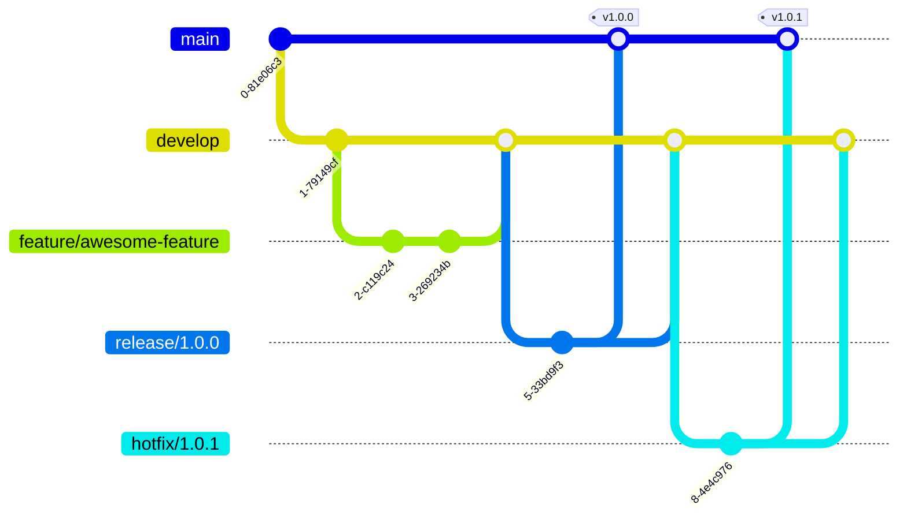

# コントリビューションガイド

loop-engineering-template へのコントリビューションを歓迎します！

## Git Flow ブランチ戦略

このプロジェクトは **Git Flow** を採用しています。

### ブランチ構成

| ブランチ | 用途 | 保護 | 生存期間 |
|----------|------|------|----------|
| `main` | 本番リリース (最新安定版) | ✅ 直接push禁止・PR必須・ステータスチェック必須 | 永続 |
| `develop` | 開発統合 / 次期リリース準備 | ✅ 直接push禁止・PR必須 | 永続 |
| `feature/*` | 機能開発 (`develop` から派生) | ❌ 任意の保護 (必要に応じて) | 機能完了まで |
| `release/*` | リリース候補 (`develop` から派生) | ✅ PR必須 | リリース完了まで |
| `hotfix/*` | 緊急修正 (`main` から派生) | ✅ PR必須・レビュー必須 | 修正完了まで |

### ワークフロー



#### 通常の開発フロー

1. `develop` から feature ブランチを作成
   ```bash
   git checkout develop
   git pull origin develop
   git checkout -b feature/your-feature-name
   ```
2. 機能を実装し、こまめにコミット
3. `develop` を最新に更新して rebase
   ```bash
   git fetch origin
   git rebase origin/develop
   ```
4. `develop` に向けて Pull Request を作成
5. CI がパスし、レビュー承認後マージ

#### リリースフロー

1. `develop` から release ブランチを作成
   ```bash
   git checkout develop
   git checkout -b release/1.0.0
   ```
2. バージョンバンプ、最終調整をコミット
3. `main` と `develop` の両方に PR を作成
4. `main` マージ時にタグ付け (`v1.0.0`)
5. GitHub Release が自動生成される

#### ホットフィックスフロー

1. `main` から hotfix ブランチを作成
   ```bash
   git checkout main
   git checkout -b hotfix/1.0.1
   ```
2. 修正をコミット
3. `main` と `develop` の両方に PR を作成
4. 優先レビュー + CI パス後マージ

### ブランチ命名規則

| 種別 | 命名パターン | 例 |
|------|-------------|-----|
| feature | `feature/<issue-id>-<description>` | `feature/42-add-markdown-lint` |
| release | `release/<version>` | `release/1.0.0` |
| hotfix | `hotfix/<version>-<short-desc>` | `hotfix/1.0.1-fix-crash` |
| bugfix | `bugfix/<issue-id>-<description>` | `bugfix/17-fix-ci-timeout` |

---

## セキュリティ & 品質ルール

### 🔒 ブランチ保護ルール (main / develop)

GitHub リポジトリ設定で以下を有効にしてください：

| ルール | main | develop |
|--------|------|---------|
| 直接push禁止 | ✅ | ✅ |
| PR必須 | ✅ | ✅ |
| 承認レビュー数 | 2 (repo owner team members only) | 1 |
| ステータスチェック必須 | ✅ (CI全件) | ✅ (CI全件) |
| 会話の解決必須 | ✅ | ✅ |
| 履歴の線形維持 | ✅ (Rebase merge) | ✅ (Squash merge) |
| 期限切れレビューの却下 | ✅ | ✅ |
| CODEOWNERS 必須 | ✅ | ❌ |

> **Note:** Repo owners can bypass the 2-approver requirement and merge directly, but CI checks must still pass regardless of who merges.

### 🛡️ 必須 CI チェック

全 PR は以下のチェックをパスする必要があります：

- **CI** — テスト / lint / ビルド (`ci.yml`)
- **CodeQL** — セキュリティ脆弱性スキャン (`codeql.yml`)
- **Dependency Review** — 依存関係の脆弱性チェック (`dependency-review.yml`)
- **Pre-commit** — 以下をローカルでも実行推奨 (`.pre-commit-config.yaml`)

### 📝 コミット署名

- 全コミットには **署名 (GPG / SSH / S/MIME)** を推奨
- `main` と `develop` へのマージコミットは署名必須
  ```bash
  git config commit.gpgsign true
  git config tag.gpgsign true
  ```

### 🔐 機密情報の禁止

- 秘密鍵・トークン・パスワードをリポジトリにコミットしない
- `.gitignore` で `.env` / `*.key` / `credentials*` を除外済み
- pre-commit の `detect-private-key` フックがコミット時にチェック
- 誤ってコミットした場合は、直ちにシークレットをローテーションし、`git filter-branch` で除去

### 📋 PR 要件

#### feature → develop
- [ ] CI がパスしている
- [ ] 最低1名のレビュー承認
- [ ] `develop` から rebase 済み (マージコンフリクトなし)
- [ ] コミットメッセージが Conventional Commits 形式

#### release → main / develop
- [ ] CI + CodeQL + Dependency Review 全パス
- [ ] 最低2名のレビュー承認
- [ ] バージョン番号が更新済み
- [ ] CHANGELOG / Release Notes が更新済み (該当する場合)

#### hotfix → main / develop
- [ ] 緊急ラベルが付与されている
- [ ] CI + CodeQL + Dependency Review 全パス
- [ ] 最低2名のレビュー承認 (スキップは要相談)
- [ ] 修正内容が `develop` にも反映されることを確認

---

## 開発の流れ (詳細)

### 1. Issue を作成

機能リクエストやバグ報告はまず Issue で議論してください。テンプレートが用意されています：

- [Bug Report](.github/ISSUE_TEMPLATE/bug_report.md)
- [Feature Request](.github/ISSUE_TEMPLATE/feature_request.md)
- [Security Vulnerability](SECURITY.md) → 公開Issueではなく、メールで報告

### 2. ブランチを作成

Git Flow に従い、適切な基点からブランチを作成してください（上記「Git Flow ブランチ戦略」参照）。

### 3. 変更を実装

以下のガイドラインに従ってください。

#### コードスタイル

- Markdown は `markdownlint` に準拠
- YAML は整形式であること
- スキル (SKILL.md) は agentskills.io 標準フォーマットに準拠
- pre-commit を実行してからコミットすること：
  ```bash
  pre-commit run --all-files
  ```

#### スキル追加時のルール

- `.agents/skills/<name>/SKILL.md` に配置
- YAML frontmatter に `name`, `description`, `tags`, `category` を必須
- 説明は具体的で実行可能な手順であること
- 可能な限り多言語での利用を考慮した記述に

### 4. Pull Request を作成

テンプレートに従い、PRの種類（feature / release / hotfix）を明記してください。

### 5. レビューとマージ

- レビュアーは CODEOWNERS に記載されたメンバーから自動アサインされます
- 全てのチェックがパスし、必要な承認数を満たしたらマージされます
- マージ方法：
  - `develop` ← `feature/*` : **Squash merge** (履歴を1つにまとめる)
  - `develop` ← `release/*` : **Merge commit**
  - `main` ← `release/*` : **Merge commit** (タグ付け)
  - `main` ← `hotfix/*` : **Merge commit** (タグ付け)

---

## CI パイプライン

| ワークフロー | トリガー | 役割 |
|-------------|---------|------|
| `ci.yml` | push/PR (main, develop, release/*, hotfix/*) | テスト・lint・ビルド |
| `codeql.yml` | push/PR (main, develop) + 週次スケジュール | セキュリティ脆弱性スキャン |
| `dependency-review.yml` | PR (main, develop) | 依存関係の脆弱性チェック |
| `release.yml` | tag push (`v*.*.*`) | GitHub Release の自動作成 |

---

## 質問・議論

- Issue で質問してください
- 大きな変更は事前に Issue で提案し、フィードバックを得てから実装してください
- セキュリティに関する報告は **公開Issueではなく** [SECURITY.md](SECURITY.md) に従って報告してください

## 行動規範

このプロジェクトに参加する全ての人は、respectful で包括的な態度を守ることに同意したものとみなします。
