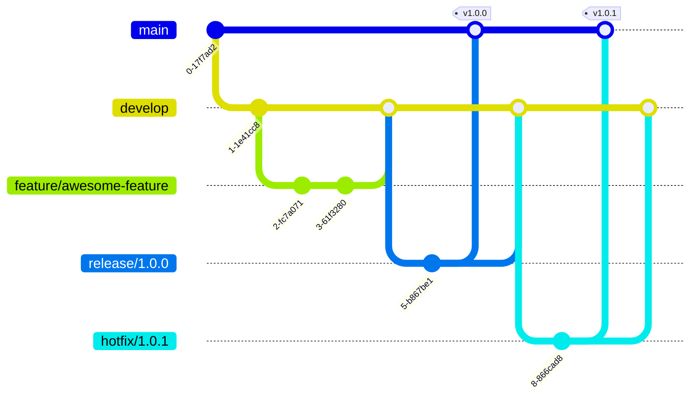

# Contributing Guide

Welcome! We're excited that you're interested in contributing to the loop-engineering-template.

## Table of Contents

- [Git Flow Strategy](#git-flow-strategy)
- [Branch Naming](#branch-naming)
- [Development Workflow](#development-workflow)
- [PR Requirements](#pr-requirements)
- [Branch Protection Rules](#branch-protection-rules)
- [Code Style](#code-style)
- [Adding Skills](#adding-skills)
- [CI Pipeline](#ci-pipeline)
- [Security](#security)

---

## Git Flow Strategy

This project follows **Git Flow** with these branches:

| Branch | Purpose | Protection | Lifespan |
|--------|---------|------------|----------|
| `main` | Production releases (latest stable) | ✅ Push-protected, PR + status checks required | Permanent |
| `develop` | Development integration | ✅ Push-protected, PR required | Permanent |
| `feature/*` | Feature development (from `develop`) | ❌ Optional | Until feature complete |
| `release/*` | Release candidates (from `develop`) | ✅ PR required | Until release |
| `hotfix/*` | Urgent fixes (from `main`) | ✅ PR + review required | Until fix merged |

### Workflow



### Normal Development Flow

1. Create a feature branch from `develop`:
   ```bash
   git checkout develop
   git pull origin develop
   git checkout -b feature/your-feature-name
   ```
2. Implement your changes, committing frequently
3. Keep your branch up to date:
   ```bash
   git fetch origin
   git rebase origin/develop
   ```
4. Create a Pull Request targeting `develop`
5. CI must pass and review approval is required

### Release Flow

1. Create a release branch from `develop`:
   ```bash
   git checkout develop
   git checkout -b release/1.0.0
   ```
2. Bump version, make final adjustments
3. Create PRs to both `main` and `develop`
4. Tag the `main` merge commit (`v1.0.0`)
5. GitHub Release auto-generated

### Hotfix Flow

1. Create a hotfix branch from `main`:
   ```bash
   git checkout main
   git checkout -b hotfix/1.0.1
   ```
2. Fix and commit
3. Create PRs to both `main` and `develop`
4. Priority review + CI pass required

---

## Branch Naming

| Type | Pattern | Example |
|------|---------|---------|
| feature | `feature/<issue-id>-<description>` | `feature/42-add-markdown-lint` |
| release | `release/<version>` | `release/1.0.0` |
| hotfix | `hotfix/<version>-<short-desc>` | `hotfix/1.0.1-fix-crash` |
| bugfix | `bugfix/<issue-id>-<description>` | `bugfix/17-fix-ci-timeout` |

---

## PR Requirements

### feature → develop
- [ ] CI passes
- [ ] At least 1 review approval
- [ ] Rebased on latest `develop` (no conflicts)
- [ ] Conventional Commits format

### release → main / develop
- [ ] CI + CodeQL + Dependency Review all pass
- [ ] At least 2 review approvals
- [ ] Version number updated
- [ ] CHANGELOG updated

### hotfix → main / develop
- [ ] `urgent` label applied
- [ ] CI + CodeQL + Dependency Review all pass
- [ ] At least 2 review approvals
- [ ] Fix confirmed applied to `develop` too

---

## Branch Protection Rules

Enable these in your GitHub repository settings:

| Rule | `main` | `develop` |
|------|--------|-----------|
| Require PR | ✅ | ✅ |
| Required reviewers | 2 | 1 |
| Required status checks | ✅ All CI | ✅ All CI |
| Require conversation resolution | ✅ | ✅ |
| Linear history (Rebase merge) | ✅ | ✅ (Squash merge) |
| Dismiss stale reviews | ✅ | ✅ |
| CODEOWNERS required | ✅ | ❌ |

---

## Code Style

### General
- Markdown follows `markdownlint` conventions
- YAML must be well-formed
- Skills follow [agentskills.io](https://agentskills.io) format
- Run pre-commit before committing:
  ```bash
  pre-commit run --all-files
  ```

### When Adding Skills

- Place in `.agents/skills/<name>/SKILL.md`
- Frontmatter must include: `name`, `description`, `tags`, `category`
- Description must be concrete and actionable
- Consider multi-language agent compatibility
- Include an `evals/evals.json` with at least 2 test cases

---

## CI Pipeline

| Workflow | Trigger | Purpose |
|----------|---------|---------|
| `ci.yml` | push/PR (protected branches) | Lint, validate skills, eval harness |
| `codeql.yml` | push/PR + weekly | Security vulnerability scan |
| `dependency-review.yml` | PR | Dependency vulnerability check |
| `release.yml` | tag `v*.*.*` | GitHub Release auto-creation |
| `agent-harness.yml` | `workflow_dispatch` | Agent task execution in CI |

---

## Security

See [SECURITY.md](SECURITY.md) for the full security policy.

Key points:
- **Do NOT** report vulnerabilities in public Issues
- Use GitHub Private Advisory or email
- Response SLA: Critical 24h, High 48h, Medium 5d, Low 14d
- pre-commit hooks check for private keys automatically

---

## Questions & Discussion

- Open an Issue for questions
- Discuss major changes in an Issue before implementation
- Use [Discussions](https://github.com/shira022/loop-engineering-template/discussions) for broader topics

---

## 🇯🇵 日本語

loop-engineering-template へのコントリビューションを歓迎します！
日本語の詳細なコントリビューションガイドは [CONTRIBUTING.ja.md](CONTRIBUTING.ja.md) をご覧ください。
