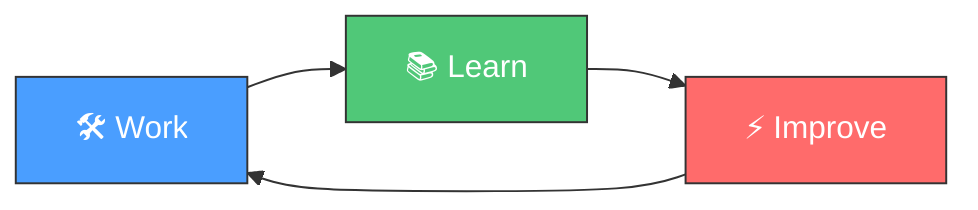

<h1 align="center">🔄 Loop Engineering Template</h1>

<p align="center">
  <em>AIエージェント駆動型ソフトウェア開発手法</em>
</p>

<p align="center">
  <a href="https://github.com/shira022/loop-engineering-template/actions/workflows/ci.yml">
    
  </a>
  <a href="https://github.com/shira022/loop-engineering-template/actions/workflows/codeql.yml">
    
  </a>
  <a href="LICENSE">
    
  </a>
  <a href="https://agentskills.io">
    
  </a>
  <a href="https://github.com/shira022/loop-engineering-template/stargazers">
    
  </a>
  <a href="https://github.com/shira022/loop-engineering-template/network/members">
    
  </a>
</p>

<p align="center">
  <b>Hermes Agent</b> ·
  <b>Opencode</b> ·
  <b>Claude Code</b> ·
  <b>Gemini CLI</b> ·
  <b>Cursor</b> ·
  <b>GitHub Copilot</b>
</p>

---

## 📖 概要

**Loop Engineering** は、AIエージェントが **Work（作業）→ Learn（学習）→ Improve（改善）** のサイクルを継続的に繰り返すことで、セッションを重ねるごとにパフォーマンスが向上するソフトウェア開発手法です。

このテンプレートは、Loop Engineering を実践するために必要なすべてを提供します — スキルオーケストレーションシステム、CI/CD、ブランチ戦略、セキュリティポリシーまで、すべてパッケージ化されています。



---

## ✨ 特徴

### 🧠 エージェントファーストアーキテクチャ

- **9つのビルトインスキル** — オーケストレーター、知識収穫、スキルクラフター、意思決定記録、セッションレビューアー、プロジェクトブートストラッパー、プロジェクトマネージャー、テストポリシー、トリアージ
- **agentskills.io 互換** — 主要なAIコーディングエージェントすべてで動作
- **スキル自動生成** — 繰り返しパターンを自動検出してスキル化
- **プロバイダ非依存のサブエージェント** — explorer, implementer, verifier の3ロールをニュートラルなYAML形式で定義
- **自動化対応** — プリコンフィグ済みスケジュール、トリアージスキル、/goal ループ
- **状態管理** — STATE.md が「何を試したか」「何が成功したか」「何が未解決か」をセッション間で追跡
- **トリアージインボックス** — ループが処理できない項目は人間のレビューへルーティング

### 🔄 ループサイクル

| フェーズ | スキル | 処理内容 |
|---------|-------|---------|
| 🛠️ **Work** | `loop-engineer` | セッションのオーケストレーション、過去コンテキストの読込 |
| 📚 **Learn** | `knowledge-harvest` | 複雑タスクから構造化知識を抽出 |
| ⚡ **Improve** | `skill-crafter` | 3回繰り返されたパターンからスキルを自動生成 |
| 📝 **Record** | `decision-recorder` | アーキテクチャ決定をADRとして記録 |
| 🔍 **Review** | `session-reviewer` | セッション終了時の振り返りとアクションアイテム抽出 |

### 🤖 サブエージェントシステム（メーカー/チェッカー分離）

- **3つの汎用ロール** — explorer（読み取り専用）、implementer（コード作成）、verifier（レビュー）
- **プロバイダ非依存YAML形式** — Claude Code / Codex / Hermes / Opencode で動作
- **ロールごとに異なるモデル** を使うことで、異なる種類のミスを検出
- **特定のエージェントプラットフォームへの依存なし**

### ⏰ 自動化

- **スケジュール済みCIトリアージ** — `agent-harness.yml` が平日07:00 UTCに実行
- **設定可能なスケジュール** — `.agents/config/schedules.yaml` で日次/週次/イベント駆動タスクを定義
- **トリアージスクリプト** — `scripts/daily-triage.sh` がCI・Issue・コミットを分析
- **手動実行** も `workflow_dispatch` で常時可能

### 🔌 コネクタ（MCP）

- **GitHub MCP** — PR作成、Issueレビュー、リポジトリ管理
- **Linear MCP** — PR作成時のチケット自動更新
- **Slack MCP** — トリアージ結果のチャンネル通知
- **Filesystem MCP** — サブエージェント用ローカルファイルアクセス
- **拡張可能** — MCP互換サーバーを追加可能

### 🏗️ プロジェクト基盤

- **Git Flow** — `main` / `develop` / `feature/*` / `release/*` / `hotfix/*`
- **CI/CD** — 5つのGitHub Actionsワークフロー（CI, CodeQL, Dependency Review, Agent Harness, Release）
- **セキュリティ** — SECURITY.md（SLA付き）、pre-commit hooks、CODEOWNERS、ブランチ保護
- **Dev Container** — VS Code / GitHub Codespaces 対応済み
- **MCPサポート** — Model Context Protocol 設定（filesystem, GitHub, database）

### 🌐 言語非依存

このテンプレートは特定の言語に依存しません。`project-bootstrapper` スキルが以下の言語・フレームワークのセットアップをガイドします：

`Python` · `TypeScript` · `Rust` · `Go` · `Java` · `Kotlin` · `Swift` · `C#` · and more

---

## 🚀 はじめよう

あなたのレベルに合わせて選んでください。各レベルは前のレベルの上に構築されます。

### Lv0 — テンプレートからプロジェクト作成（2分）

```bash
gh repo create my-project --template shira022/loop-engineering-template --public
git clone https://github.com/your-org/my-project.git
cd my-project
```

**プライベートリポジトリの場合：**
```bash
gh repo create my-project --template shira022/loop-engineering-template --private
```

**既にローカルにクローン済みの場合：**
```bash
cd my-project
git remote remove origin
gh repo create my-project --private --source=. --push
```

> ✅ 完了。CI/CD、Git Flow設定、9つのエージェントスキルが揃ったプロジェクトができました。
> 次に：AIエージェントを起動して *「このプロジェクトをブートストラップして」* と指示してください。

### Lv1 — 手動トリアージを実行（+5分）

```bash
# トリアージスクリプトを実行（CI、Issue、コミットを分析）
bash scripts/daily-triage.sh

# レポートを確認
cat learnings/triage-$(date +%F).md

# ループが見つけたものを確認
cat STATE.md
```

トリアージスクリプトは以下を分析します：CIの実行状態、オープンIssue、最近のコミット。結果を `learnings/` にレポートとして書き出し、`STATE.md` を更新します。

### Lv2 — Verifierサブエージェントを追加（+10分）

```bash
# Opencode
alias verify='opencode --task "Review changes: $(git diff --cached). Run tests. No code."'

# Claude Code
claude --task "Review the changes. Be skeptical. Run all tests."

# Hermes (delegate_task)
# delegate_task(goal="Verify changes", context="...") をセッション内で使用
```

Verifierは実装者が見逃したミスをキャッチします。コードは書かず、レビューのみを行います。

### Lv3 — 自動化を設定（+5分）

**GitHub Actions**（`.github/workflows/agent-harness.yml` に同梱）：
```yaml
on:
  schedule:
    - cron: '0 7 * * 1-5'   # 平日07:00 UTC
```

**ローカルcron：**
```bash
crontab -e
0 7 * * 1-5 cd /path/to/repo && bash scripts/daily-triage.sh
```

**Hermes cron：**
```bash
hermes cron create \
  --schedule "0 7 * * 1-5" \
  --skill triage \
  --prompt "Run daily CI triage"
```

### Lv4 — 完全なOne Loop（+15分）

6つの構成要素すべてが連携：

```
07:00  自動化トリガー（cron / GitHub Actions）
       ↓
07:01  ExplorerサブエージェントがCI + Issue + コミットを読込
       ↓
07:05  トリアージレポート → learnings/triage-YYYY-MM-DD.md
       ↓
07:06  修正可能な項目 → git worktree 分離
       ↓
07:10  Implementerがworktree内で修正コードを作成
       ↓
07:15  Verifierがレビュー + テスト実行
       ↓
07:20  成功 → コネクタがPR作成、チケット更新、Slack通知
       ↓
07:25  STATE.md更新 → 次回実行はここから継続
```

詳細は [docs/loop-patterns.md](docs/loop-patterns.md)（英語）を参照。

---

### ブートストラッパーの動作

エージェントに *「このプロジェクトをブートストラップして」* と指示すると、`project-bootstrapper` スキルが以下を実行します：

1. **対話形式で以下をヒアリング**
   - プロジェクト名、リポジトリの公開/非公開設定
   - 言語、フレームワーク、ビルドツール、テストフレームワーク
   - プロジェクトの説明
2. **GitHubリポジトリ**をテンプレートから作成
3. `$HOME/project/<name>/repo-<name>/` に**クローン**
4. 言語固有の**CI設定・.gitignore・プロジェクトスケルトンを動的生成**
5. すべてを**コミット＆プッシュ**
6. `repo-registry.yaml` に**プロジェクトを登録**
7. **セルフデストラクト**（一度きりの実行）

> ⚠️ 初回ブートストラップセッションは約5K～15Kトークンを消費します。

### 前提条件

| ツール | 必須 | 目的 |
|-------|------|------|
| `git` | ✅ 必須 | バージョン管理 |
| `gh` CLI | ✅ 必須 | GitHubリポジトリ作成 |
| `python3` | ✅ 推奨 | 検証スクリプト（`validate-skills.py` 等） |
| AIエージェント | ✅ 必須 | Hermes / Opencode / Claude Code 等の agentskills.io 互換エージェント |

---

## 📁 ディレクトリ構成

```
.
├── .agents/skills/           # 9つの agentskills.io 互換スキル
│   ├── loop-engineer/        # セッションオーケストレーター
│   ├── knowledge-harvest/    # タスク完了後の学び抽出
│   ├── skill-crafter/        # 繰り返しパターンから自動スキル化
│   ├── decision-recorder/    # Architecture Decision Records
│   ├── session-reviewer/     # セッション終了時の振り返り
│   ├── project-bootstrapper/ # 新規プロジェクト作成（初回のみ）
│   ├── project-manager/      # 複数プロジェクトタスク管理
│   ├── test-policy/          # テストカバレッジ80%以上を強制
│   └── triage/               # 定期CIトリアージ＆自動化ディスパッチ
├── .agents/agents/           # サブエージェント定義（explorer, implementer, verifier）
├── .agents/config/           # 自動化スケジュール設定ファイル
├── .devcontainer/            # VS Code / Codespaces 開発コンテナ
├── .github/workflows/        # CI / CodeQL / Dependabot / Agent Harness / Release
├── .mcp/                     # MCP設定（GitHub, Linear, Slack, SQLite）
├── docs/
│   ├── adr/                  # Architecture Decision Records
│   ├── eval-harness.md       # スキル評価フレームワーク
│   ├── architecture.md       # システムアーキテクチャ
│   ├── loop-patterns.md      # One Loop 完全ワークフローガイド
│   ├── quickstart-loop.md    # 15分クイックスタート
│   ├── triage-inbox.md       # トリアージインボックスパターン
│   ├── worktree-isolation.md # Worktree分離
│   ├── hub-workflow.md       # マルチプロジェクトハブ運用
│   └── schedule-setup.md     # スケジュールプラットフォーム別ガイド
├── inbox/                    # トリアージインボックス
├── learnings/                # セッション学び
├── scripts/                  # ユーティリティスクリプト
├── traces/                   # エージェント実行トレース
├── AGENTS.md                 # エージェント向けルール
├── CONTRIBUTING.md           # コントリビューションガイド
├── Makefile                  # タスクランナー
├── STATE.md                  # ループ状態管理
├── TESTING.md                # テストポリシー
└── SECURITY.md               # セキュリティ脆弱性報告
```

---

## 🛠️ ビルトと呼スキル

| スキル | 説明 | トリガー |
|-------|------|---------|
| **loop-engineer** | セッションオーケストレーター — コンテキスト読込、スキル調整、カウンター管理 | セッション開始時 |
| **knowledge-harvest** | 構造化学びを `learnings/` に抽出 | ツールコール5回後 |
| **skill-crafter** | パターン3回繰り返しで新スキル作成 | パターン閾値到達時 |
| **decision-recorder** | ADRをアーキテクチャ決定として記録 | 重要な決定時 |
| **session-reviewer** | セッション終了時の振り返り | セッション終了時 |
| **triage** | 定期CIトリアージ＆自動化ディスパッチ | 日次スケジュールまたは手動 |
| **project-bootstrapper** | 新規プロジェクトの足場作り | 初回のみ（セルフデストラクト） |
| **project-manager** | git worktree を使った複数プロジェクトタスク管理 | タスクディスパッチ時 |
| **test-policy** | 全コードのテストカバレッジ80%以上を強制 | PR/コミット毎 |

---

## 🤖 エージェント互換性

このテンプレートは [agentskills.io](https://agentskills.io) 形式を使用しており、以下のエージェントと互換性があります：

| エージェント | 状態 | 備考 |
|------------|------|------|
| **Hermes Agent** | ✅ 完全対応 | ネイティブ agentskills.io サポート |
| **Opencode** | ✅ 完全対応 | `opencode --task` でスキル読込 |
| **Claude Code** | ✅ 互換 | `.agents/skills/` を自動読込 |
| **Gemini CLI** | ✅ 互換 | agentskills.io 形式対応 |
| **Cursor** | ✅ 互換 | `.cursorrules` 相当 |
| **GitHub Copilot** | ✅ 互換 | `AGENTS.md` の指示を読込 |

---

## 📊 CI/CD パイプライン

| ワークフロー | トリガー | 目的 |
|------------|---------|------|
| **CI** | push + PR（保護ブランチ） | スキルバリデーション、lint、evalハーネス |
| **CodeQL** | push + PR + 週次 | セキュリティ脆弱性スキャン |
| **Dependency Review** | PR | 依存関係脆弱性チェック |
| **Agent Harness** | `workflow_dispatch` | GitHub Actions でエージェント実行 |
| **Release** | タグ `v*.*.*` | GitHub Release 自動作成 |
| **Dependabot** | 週次 | 依存関係自動更新 |

---

## ⚡ クイックリファレンス

### エージェント別セットアップ

| エージェント | 起動コマンド | 備考 |
|------------|-------------|------|
| **Hermes** | `hermes` | ネイティブ `.agents/skills/` 対応。サブエージェントは `delegate_task()`、スケジュールは `cronjob` を使用 |
| **Opencode** | `opencode --task "..."` | サブエージェント（implementer/verifier）として最適。セットアップは `opencode --task "Bootstrap this project"` |
| **Claude Code** | `claude` | `.agents/skills/` 自動読込。サブエージェントは `.claude/agents/` |
| **Gemini CLI** | `gemini` | agentskills.io 形式ネイティブ対応 |
| **Cursor** | Cursorでプロジェクトを開く | `.agents/skills/` 自動読込 |
| **GitHub Copilot** | `github-copilot` | `AGENTS.md` をプロジェクトコンテキストとして読込 |

### スクリプトリファレンス

| スクリプト | 目的 | 実行タイミング |
|-----------|------|--------------|
| `scripts/daily-triage.sh` | CI状態・Issue・コミットを読取り → `learnings/` にレポート | 日次（手動またはcron） |
| `scripts/goal-loop.sh` | 複雑タスク用の「完了するまでループ」 | オンデマンド |
| `scripts/agent-runner.sh` | 汎用エージェント実行ハーネス | CIまたは手動 |
| `scripts/validate-skills.py` | 全スキルのfrontmatterバリデーション | スキル編集後 |
| `scripts/validate-configs.py` | サブエージェントYAML・スケジュールYAML・MCP JSONのバリデーション | 設定編集後 |
| `scripts/run-evals.py` | 全スキル評価テストケース実行 | CIまたはpre-commit |
| `scripts/quickstart.sh` | プロジェクト完全ブートストラップ | 初回のみ |
| `scripts/analyze-traces.py` | `traces/` のエージェント実行トレース分析 | パフォーマンスレビュー時 |
| `scripts/validate-branch-name.py` | Git Flow ブランチ命名規則バリデーション | Git hookまたはCI |

### ハブ運用（マルチプロジェクト）

複数のプロジェクトを単一のハブリポジトリ（例：`hermes-project/`）で管理する場合：

```
hermes-project/
├── AGENTS.md                 # ハブレベルのルール
├── .agents/skills/ → テンプレートへのシンボリックリンク
├── project/
│   ├── repo-registry.yaml    # プロジェクトレジストリ
│   ├── app-1/repo-app-1/     # テンプレートから作成したプロジェクト
│   └── app-2/repo-app-2/     # 別のプロジェクト
└── loop-engineering-template/ # テンプレートサブモジュール/クローン
```

セットアップ手順は [docs/hub-workflow.md](docs/hub-workflow.md) を参照。

---

## 📝 コントリビューション

コントリビューションを歓迎します！[CONTRIBUTING.md](CONTRIBUTING.md)（英語）をご覧ください：

- Git Flow ブランチ戦略
- ブランチ命名規則
- PR要件
- コードスタイルガイドライン
- セキュリティ脆弱性報告

### コントリビューター向けクイックスタート

```bash
# クローンとセットアップ
git clone https://github.com/shira022/loop-engineering-template.git
cd loop-engineering-template
make setup    # 開発依存関係をインストール
make lint     # lintチェックを実行
make validate # 全スキルをバリデーション
```

---

## 🔒 セキュリティ

[SECURITY.md](SECURITY.md)（英語）に完全なセキュリティポリシーがあります。重要ポイント：

- **非公開報告**：GitHub Private Advisory から報告してください
- **対応SLA**：Critical 24時間以内、High 48時間以内
- **協調開示**：修正後に公開開示します

---

## 📄 ライセンス

MIT © [shira022](https://github.com/shira022)

---

## 🌟 サポート

- ⭐ このリポジトリが役立つと思ったらスターをお願いします
- 🐛 [バグ報告](https://github.com/shira022/loop-engineering-template/issues/new?labels=bug&template=bug_report.md)
- 💡 [機能提案](https://github.com/shira022/loop-engineering-template/issues/new?labels=enhancement&template=feature_request.md)
- 💬 [ディスカッション](https://github.com/shira022/loop-engineering-template/discussions)
