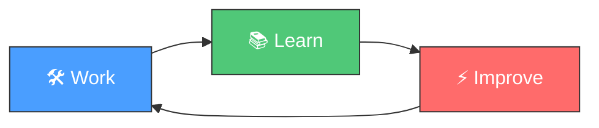

<h1 align="center">🔄 Loop Engineering Template</h1>

<p align="center">
  <em>The AI-Agent-Driven Software Development Methodology</em>
</p>

<p align="center">
  <a href="https://github.com/shira022/loop-engineering-template/actions/workflows/ci.yml">
    
  </a>
  <a href="https://github.com/shira022/loop-engineering-template/actions/workflows/codeql.yml">
    
  </a>
  <a href="LICENSE">
    
  </a>
  <a href="https://agentskills.io">
    
  </a>
  <a href="https://github.com/shira022/loop-engineering-template/stargazers">
    
  </a>
  <a href="https://github.com/shira022/loop-engineering-template/network/members">
    
  </a>
</p>

<p align="center">
  <b>Hermes Agent</b> · 
  <b>Opencode</b> · 
  <b>Claude Code</b> · 
  <b>Gemini CLI</b> · 
  <b>Cursor</b> · 
  <b>GitHub Copilot</b>
</p>

---

## 📖 Overview

**Loop Engineering** is a methodology where AI agents follow a continuous **Work → Learn → Improve** cycle. With each session, the agent becomes more effective by persisting knowledge as reusable **skills**.

This template gives you everything you need to start a new project with loop engineering built in — from the skill orchestration system to CI/CD, branching strategy, and security policies.



---

## ✨ Features

### 🧠 Agent-First Architecture
- **8 built-in skills** — orchestrator, knowledge harvester, skill crafter, decision recorder, session reviewer, project bootstrapper, project manager, test policy
- **agentskills.io compatible** — works with every major AI coding agent
- **Skill auto-creation** — repeated patterns are automatically detected and codified

### 🔄 The Loop Cycle

| Phase | Skill | What Happens |
|-------|-------|-------------|
| 🛠️ **Work** | `loop-engineer` | Orchestrates the session, loads past context |
| 📚 **Learn** | `knowledge-harvest` | Extracts structured knowledge from complex tasks |
| ⚡ **Improve** | `skill-crafter` | Auto-creates skills from 3× repeated patterns |
| 📝 **Record** | `decision-recorder` | Captures architecture decisions as ADRs |
| 🔍 **Review** | `session-reviewer` | Retrospectives with action items for next session |

### 🏗️ Project Infrastructure
- **Git Flow** — `main` / `develop` / `feature/*` / `release/*` / `hotfix/*`
- **CI/CD** — 5 GitHub Actions workflows (CI, CodeQL, Dependency Review, Agent Harness, Release)
- **Security** — SECURITY.md with SLA, pre-commit hooks, CODEOWNERS, branch protection
- **Dev Container** — ready-to-use VS Code / GitHub Codespaces setup
- **MCP Support** — Model Context Protocol configuration for filesystem, GitHub, database

### 🌐 Language Agnostic
This template doesn't lock you into any language. The `project-bootstrapper` skill guides you through setup for:

`Python` · `TypeScript` · `Rust` · `Go` · `Java` · `Kotlin` · `Swift` · `C#` · and more

---

## 🚀 Getting Started

### Option 1: Use the template directly

```bash
# Create a new repository from this template
gh repo create my-project --template shira022/loop-engineering-template --public
git clone https://github.com/your-org/my-project.git
cd my-project

# Launch your AI agent and tell it:
# "Bootstrap this project using the project-bootstrapper skill"
```

### Option 2: Quickstart script

```bash
# Download and run the quickstart (coming soon)
curl -sL https://raw.githubusercontent.com/shira022/loop-engineering-template/main/scripts/quickstart.sh | bash
```

### Prerequisites

| Tool | Required | Purpose |
|------|----------|---------|
| `git` | ✅ Yes | Version control |
| `gh` CLI | ✅ Yes | GitHub repository creation |
| AI Agent | ✅ Yes | Hermes, Opencode, Claude Code, or any agentskills.io-compatible agent |

---

## 📁 Directory Structure

```
.
├── .agents/skills/           # 8 agentskills.io-compatible skills
│   ├── loop-engineer/        # Core session orchestrator
│   ├── knowledge-harvest/    # Extract learnings from completed tasks
│   ├── skill-crafter/        # Auto-create skills from repeated patterns
│   ├── decision-recorder/    # Architecture Decision Records
│   ├── session-reviewer/     # End-of-session retrospectives
│   ├── project-bootstrapper/ # Bootstrap new projects from this template
│   ├── project-manager/      # Cross-project task management
│   └── test-policy/          # Enforce comprehensive test coverage
├── .devcontainer/            # VS Code / Codespaces dev container
├── .github/workflows/        # CI / CodeQL / Dependabot / Agent Harness / Release
├── .mcp/                     # Model Context Protocol configuration
├── docs/
│   ├── adr/                  # Architecture Decision Records
│   ├── eval-harness.md       # Skill evaluation framework docs
│   └── architecture.md       # System architecture documentation
├── learnings/                # Session learnings and knowledge
├── scripts/                  # Utility scripts (validate, eval, branch name)
├── traces/                   # Agent execution traces
├── AGENTS.md                 # Agent-facing rules and conventions
├── CONTRIBUTING.md           # Contribution guidelines
├── Makefile                  # Task runner
├── TESTING.md                # Testing policy
└── SECURITY.md               # Security vulnerability reporting
```

---

## 🛠️ Built-in Skills

| Skill | Description | Trigger |
|-------|-------------|---------|
| **loop-engineer** | Session orchestrator — loads context, coordinates skills, manages counters | Every session start |
| **knowledge-harvest** | Extracts structured learnings to `learnings/` | After 5+ tool calls |
| **skill-crafter** | Creates new skills when patterns repeat 3× | On pattern threshold |
| **decision-recorder** | Writes ADRs for architectural decisions | On significant decisions |
| **session-reviewer** | Conducts end-of-session retrospectives | Session end |
| **project-bootstrapper** | Scaffolds new projects from this template | First session only (self-destructs) |
| **project-manager** | Manages tasks across multiple git worktrees | On task dispatch |
| **test-policy** | Enforces 80%+ test coverage across all code | Every PR / commit |

---

## 🤖 Agent Compatibility

This template uses the `.agents/skills/` format defined by [agentskills.io](https://agentskills.io), making it compatible with:

| Agent | Status | Notes |
|-------|--------|-------|
| **Hermes Agent** | ✅ Fully supported | Native agentskills.io support |
| **Opencode** | ✅ Fully supported | Use `opencode --task` with skills loaded |
| **Claude Code** | ✅ Compatible | Loads `.agents/skills/` automatically |
| **Gemini CLI** | ✅ Compatible | agentskills.io format supported |
| **Cursor** | ✅ Compatible | `.cursorrules` equivalent |
| **GitHub Copilot** | ✅ Compatible | Reads `AGENTS.md` instructions |

---

## 📊 CI/CD Pipelines

| Workflow | Trigger | Purpose |
|----------|---------|---------|
| **CI** | push + PR (protected branches) | Skill validation, lint, eval harness |
| **CodeQL** | push + PR + weekly | Security vulnerability scanning |
| **Dependency Review** | PR | Dependency vulnerability check |
| **Agent Harness** | `workflow_dispatch` | Run agents in GitHub Actions |
| **Release** | Tag `v*.*.*` | Automatic GitHub Release creation |
| **Dependabot** | Weekly | Automated dependency updates |

---

## 📝 Contributing

Contributions are welcome! Please see [CONTRIBUTING.md](CONTRIBUTING.md) for:

- Git Flow branch strategy
- Branch naming conventions
- PR requirements
- Code style guidelines
- Security vulnerability reporting

### Quick Start for Contributors

```bash
# Clone and set up
git clone https://github.com/shira022/loop-engineering-template.git
cd loop-engineering-template
make setup    # Install dev dependencies
make lint     # Run lint checks
make validate # Validate all skills
```

---

## 🔒 Security

See [SECURITY.md](SECURITY.md) for our security policy and vulnerability reporting process. Key points:

- **Private disclosure**: Report vulnerabilities via GitHub Private Advisory
- **Response SLA**: Critical within 24h, High within 48h
- **Coordinated disclosure**: We fix before public disclosure

---

## 📄 License

MIT © [shira022](https://github.com/shira022)

---

## 🌟 Support

- ⭐ Star this repository if you find it useful
- 🐛 [Report bugs](https://github.com/shira022/loop-engineering-template/issues/new?labels=bug&template=bug_report.md)
- 💡 [Suggest features](https://github.com/shira022/loop-engineering-template/issues/new?labels=enhancement&template=feature_request.md)
- 💬 [Start a discussion](https://github.com/shira022/loop-engineering-template/discussions)

---

## 🇯🇵 日本語

Loop Engineering は、AIエージェントが **Work（作業）→ Learn（学習）→ Improve（改善）** のサイクルを繰り返すことで、セッションを重ねるごとにパフォーマンスが向上するソフトウェア開発手法です。

このテンプレートは、Loop Engineering を実践するために必要な全スキル・CI/CD・セキュリティポリシー・ブランチ戦略をパッケージ化しています。

詳細は [README.ja.md](README.ja.md) をご覧ください。
