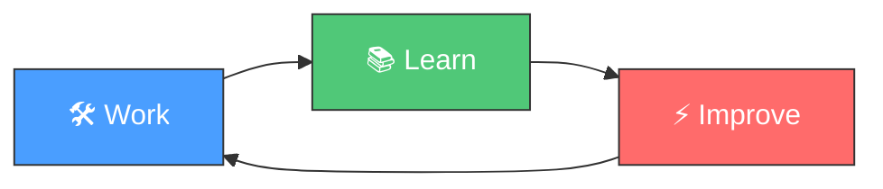

<h1 align="center">🔄 Loop Engineering Template</h1>

<p align="center">
  <em>The AI-Agent-Driven Software Development Methodology</em>
</p>

<p align="center">
  <a href="https://github.com/shira022/loop-engineering-template/actions/workflows/ci.yml">
    
  </a>
  <a href="https://github.com/shira022/loop-engineering-template/actions/workflows/codeql.yml">
    
  </a>
  <a href="https://github.com/shira022/loop-engineering-template/actions/workflows/scorecard.yml">
    
  </a>
  <a href="https://shira022.github.io/loop-engineering-template/">
    
  </a>
  <a href="LICENSE">
    
  </a>
  <a href="https://agentskills.io">
    
  </a>
  <a href="https://github.com/shira022/loop-engineering-template/stargazers">
    
  </a>
  <a href="https://codespaces.new/shira022/loop-engineering-template">
    
  </a>
  <a href="https://github.com/shira022/loop-engineering-template/network/members">
    
  </a>
</p>

<p align="center">
  <b>Hermes Agent</b> · 
  <b>Opencode</b> · 
  <b>Claude Code</b> · 
  <b>Gemini CLI</b> · 
  <b>Cursor</b> · 
  <b>GitHub Copilot</b>
</p>

---

## 📖 Overview

> 🧠 **Based on [Loop Engineering](https://addyosmani.com/blog/loop-engineering/) by [Addy Osmani](https://addyosmani.com) (Google)**  
> *Also covered by [The New Stack](https://thenewstack.io/loop-engineering/)*

**Loop Engineering** — defined by Addy Osmani in June 2026 — is a methodology where AI agents follow a continuous **Work → Learn → Improve** cycle. Instead of prompting agents one turn at a time, you design **loops**: automated systems that discover work, distribute it to sub-agents, verify results, and persist state across sessions.

This template implements the 6 building blocks of loop engineering — **Automations, Worktrees, Skills, Plugins & Connectors, Sub-agents, and State** — as a reusable project template. Start any project with loop engineering built in, regardless of language or framework.



---

## ✨ Features

### 🧠 Agent-First Architecture
- **9 built-in skills** — orchestrator, knowledge harvester, skill crafter, decision recorder, session reviewer, project bootstrapper, project manager, test policy, triage
- **agentskills.io compatible** — works with every major AI coding agent
- **Skill auto-creation** — repeated patterns are automatically detected and codified
- **Provider-agnostic sub-agents** — explorer, implementer, verifier roles in neutral YAML format
- **Automation-ready** — pre-configured schedules, triage skill, `/loop` (cadence re-run), and `/goal` (run-until-done)
- **State spine** — STATE.md tracks what's tried, what passed, what's open across sessions. *"The model forgets between runs. The repo doesn't."*
- **Triage inbox** — items the loop can't handle get routed for human review

### 🔄 The Loop Cycle

| Phase | Skill | What Happens |
|-------|-------|-------------|
| 🛠️ **Work** | `loop-engineer` | Orchestrates the session, loads past context |
| 📚 **Learn** | `knowledge-harvest` | Extracts structured knowledge from complex tasks |
| ⚡ **Improve** | `skill-crafter` | Auto-creates skills from 3× repeated patterns |
| 📝 **Record** | `decision-recorder` | Captures architecture decisions as ADRs |
| 🔍 **Review** | `session-reviewer` | Retrospectives with action items for next session |
| *Underlying the whole cycle* | **Automations** (heartbeat) + **State** (spine) | Keep the loop running and remembering |

### 🤖 Sub-Agent System (Maker/Checker Split)
- **3 generic roles** — explorer (read-only), implementer (writes code), verifier (reviews)
- **Provider-agnostic YAML format** — works with Claude Code, Codex, Hermes, Opencode
- **Different models** for different roles catches different mistake types
- **No hard dependency** on any specific agent platform

### ⏰ Automations
- **Scheduled CI triage** — `agent-harness.yml` runs weekdays at 07:00 UTC
- **Configurable schedules** — `.agents/config/schedules.yaml` defines daily/weekly/event-driven tasks
- **Triage script** — `scripts/daily-triage.sh` analyzes CI, issues, and commits
- **Manual dispatch** still available via `workflow_dispatch`

### 🔌 Plugins & Connectors (MCP)
- **GitHub MCP** — create PRs, review issues, manage repos
- **Linear MCP** — update tickets when PRs are created
- **Slack MCP** — notify channels of triage results
- **Filesystem MCP** — local file access for sub-agents
- **Extensible** — add any MCP-compatible server
- **Plugins** bundle skills and connectors together for distribution — your teammate installs your setup in one go

### 🏗️ Project Infrastructure
- **Git Flow** — `main` / `develop` / `feature/*` / `release/*` / `hotfix/*`
- **CI/CD** — 5 GitHub Actions workflows (CI, CodeQL, Dependency Review, Agent Harness, Release)
- **Security** — SECURITY.md with SLA, pre-commit hooks, CODEOWNERS, branch protection
- **Dev Container** — ready-to-use VS Code / GitHub Codespaces setup
- **MCP Support** — Model Context Protocol configuration for filesystem, GitHub, database

### 🌐 Language Agnostic
This template doesn't lock you into any language. The `project-bootstrapper` skill guides you through setup for:

`Python` · `TypeScript` · `Rust` · `Go` · `Java` · `Kotlin` · `Swift` · `C#` · and more

---

## 🚀 Getting Started

Choose your level. Each builds on the previous — start wherever matches your confidence.

### Lv0 — Create a Project from the Template (2 min)

```bash
gh repo create my-project --template shira022/loop-engineering-template --public
git clone https://github.com/your-org/my-project.git
cd my-project
```

**Private repo?**
```bash
gh repo create my-project --template shira022/loop-engineering-template --private
```

**Already cloned locally?**
```bash
cd my-project
git remote remove origin
gh repo create my-project --private --source=. --push
```

> ✅ Done. You now have a project with CI/CD, Git Flow config, and 9 agent skills.
> Next: launch your AI agent and say *"Bootstrap this project using the project-bootstrapper skill"*

### Lv1 — Run Manual Triage (+5 min)

```bash
# Run the triage script (reads CI, issues, commits)
bash scripts/daily-triage.sh

# View the report
cat learnings/triage-$(date +%F).md

# Check what the loop found
cat STATE.md
```

The triage script analyzes: CI run status, open issues, recent commits. It writes a report to `learnings/` and updates `STATE.md` with findings.

### Lv2 — Add a Verifier Sub-agent (+10 min)

```bash
# Opencode
alias verify='opencode --task "Review changes: $(git diff --cached). Run tests. No code."'

# Claude Code
claude --task "Review the changes. Be skeptical. Run all tests."

# Hermes (delegate_task)
# Use delegate_task(goal="Verify changes", context="...") in-session
```

The verifier catches mistakes the implementer missed. It never writes code — only reviews.

### Lv3 — Set Up Automation (+5 min)

**GitHub Actions** (shipped in `.github/workflows/agent-harness.yml`):
```yaml
on:
  schedule:
    - cron: '0 7 * * 1-5'   # Weekdays 07:00 UTC
```

**Local cron**:
```bash
crontab -e
0 7 * * 1-5 cd /path/to/repo && bash scripts/daily-triage.sh
```

**Hermes cron**:
```bash
hermes cron create \
  --schedule "0 7 * * 1-5" \
  --skill triage \
  --prompt "Run daily CI triage"
```

### Lv4 — Full One Loop (+15 min)

All 6 building blocks working together:

```
07:00  Automation triggers (cron / GitHub Actions)
       ↓
07:01  Explorer sub-agent reads CI + issues + commits
       ↓
07:05  Triage report → learnings/triage-YYYY-MM-DD.md
       ↓
07:06  Fixable items → git worktree isolation
       ↓
07:10  Implementer drafts fix in worktree
       ↓
07:15  Verifier reviews + runs tests
       ↓
07:20  PASS → Connectors create PR, update tickets, notify Slack
       ↓
07:25  STATE.md updated → next run picks up where this stopped
```

See [docs/loop-patterns.md](docs/loop-patterns.md) for the full breakdown.

---

### What the Bootstrapper Does

When you tell your agent *"Bootstrap this project"*, the `project-bootstrapper` skill:

1. **Asks you interactively** for:
   - Project name, repo visibility (public/private)
   - **Project directory** — where to clone locally (e.g. `~/projects/<name>/`)
   - Language, framework, build tool, test framework
   - Project description
2. **Creates** the GitHub repository from the template
3. **Clones** to your specified directory in `<dir>/<name>/repo-<name>/` layout
4. **Generates** language-specific CI config, `.gitignore`, and project skeleton
5. **Commits & pushes** everything
6. **Registers** the project in `repo-registry.yaml` (in your specified projects root)
7. **Self-destructs** (so it only runs once)

> ⚠️ Budget ~5K–15K tokens for the first bootstrap session.

### Prerequisites

| Tool | Required | Purpose |
|------|----------|---------|
| `git` | ✅ Yes | Version control |
| `gh` CLI | ✅ Yes | GitHub repository creation |
| `python3` | ✅ Recommended | Validation scripts (`validate-skills.py`, etc.) |
| AI Agent | ✅ Yes | Hermes, Opencode, Claude Code, or any agentskills.io-compatible agent |

---

## 📁 Directory Structure

```
.
├── .agents/skills/           # 9 agentskills.io-compatible skills
│   ├── loop-engineer/        # Core session orchestrator
│   ├── knowledge-harvest/    # Extract learnings from completed tasks
│   ├── skill-crafter/        # Auto-create skills from repeated patterns
│   ├── decision-recorder/    # Architecture Decision Records
│   ├── session-reviewer/     # End-of-session retrospectives
│   ├── project-bootstrapper/ # Bootstrap new projects from this template
│   ├── project-manager/      # Cross-project task management
│   ├── test-policy/          # Enforce comprehensive test coverage
│   └── triage/               # Scheduled CI triage & automation dispatch
├── .agents/agents/           # Generic sub-agent definitions (explorer, implementer, verifier)
├── .agents/config/           # Automation schedule and configuration files
├── .devcontainer/            # VS Code / Codespaces dev container
├── .github/workflows/        # CI / CodeQL / Dependabot / Agent Harness / Release
├── .mcp/                     # Model Context Protocol configuration (GitHub, Linear, Slack, SQLite)
├── docs/
│   ├── adr/                  # Architecture Decision Records
│   ├── eval-harness.md       # Skill evaluation framework docs
│   ├── architecture.md       # System architecture documentation
│   ├── loop-patterns.md      # "One Loop" complete workflow guide
│   ├── quickstart-loop.md    # 15-minute start with triage + verifier
│   ├── triage-inbox.md       # Triage inbox pattern documentation
│   ├── worktree-isolation.md # Worktree isolation for sub-agents
│   ├── hub-workflow.md       # Multi-project hub setup
│   └── schedule-setup.md     # Schedule platform translation guide
├── inbox/                    # Triage inbox — items the loop can't handle
├── learnings/                # Session learnings and knowledge
├── scripts/                  # Utility scripts (validate, eval, triage, goal-loop)
├── traces/                   # Agent execution traces
├── AGENTS.md                 # Agent-facing rules and conventions
├── CONTRIBUTING.md           # Contribution guidelines
├── Makefile                  # Task runner
├── STATE.md                  # Loop state — the spine of the system
├── TESTING.md                # Testing policy
└── SECURITY.md               # Security vulnerability reporting
```

---

## 🛠️ Built-in Skills

| Skill | Description | Trigger |
|-------|-------------|---------|
| **loop-engineer** | Session orchestrator — loads context, coordinates skills, manages counters | Every session start |
| **knowledge-harvest** | Extracts structured learnings to `learnings/` | After 5+ tool calls |
| **skill-crafter** | Creates new skills when patterns repeat 3× | On pattern threshold |
| **decision-recorder** | Writes ADRs for architectural decisions | On significant decisions |
| **session-reviewer** | Conducts end-of-session retrospectives | Session end |
| **triage** | Scheduled CI triage & automation dispatch | Daily schedule or manual |
| **project-bootstrapper** | Scaffolds new projects from this template | First session only (self-destructs) |
| **project-manager** | Manages tasks across multiple git worktrees | On task dispatch |
| **test-policy** | Enforces 80%+ test coverage across all code | Every PR / commit |

---

## 🤖 Agent Compatibility

This template uses the `.agents/skills/` format defined by [agentskills.io](https://agentskills.io), making it compatible with:

| Agent | Status | Notes |
|-------|--------|-------|
| **Hermes Agent** | ✅ Fully supported | Native agentskills.io support |
| **Opencode** | ✅ Fully supported | Use `opencode --task` with skills loaded |
| **Claude Code** | ✅ Compatible | Loads `.agents/skills/` automatically |
| **Codex (OpenAI)** | ✅ Compatible | Supports `.agents/skills/` and `AGENTS.md` |
| **Gemini CLI** | ✅ Compatible | agentskills.io format supported |
| **Cursor** | ✅ Compatible | `.cursorrules` equivalent |
| **GitHub Copilot** | ✅ Compatible | Reads `AGENTS.md` instructions |

---

## 📊 CI/CD Pipelines

| Workflow | Trigger | Purpose |
|----------|---------|---------|
| **CI** | push + PR (protected branches) | Skill validation, lint, eval harness |
| **CodeQL** | push + PR + weekly | Security vulnerability scanning |
| **Dependency Review** | PR | Dependency vulnerability check |
| **Agent Harness** | `workflow_dispatch` | Run agents in GitHub Actions |
| **Release** | Tag `v*.*.*` | Automatic GitHub Release creation |
| **Dependabot** | Weekly | Automated dependency updates |
| **Scorecard** | push + weekly | OpenSSF security scorecard |
| **Pages** | push to `main` | Documentation site on GitHub Pages |

---

## ⚡ Quick Reference

### Agent-Specific Setup

| Agent | Launch Command | Notes |
|-------|---------------|-------|
| **Hermes** | `hermes` | Native `.agents/skills/` support. Use `delegate_task()` for sub-agents, `cronjob` for schedules |
| **Opencode** | `opencode --task "..."` | Best as sub-agent (implementer/verifier). Use `opencode --task "Bootstrap this project"` for setup |
| **Claude Code** | `claude` | Automatic `.agents/skills/` loading. Sub-agents via `.claude/agents/` |
| **Codex (OpenAI)** | `codex` | Native `.agents/skills/` loading. Built-in worktree isolation per thread |
| **Gemini CLI** | `gemini` | agentskills.io format natively supported |
| **Cursor** | Open project in Cursor | Reads `.agents/skills/` automatically |
| **GitHub Copilot** | `github-copilot` | Reads `AGENTS.md` for project context |

### Scripts Reference

| Script | Purpose | When to Run |
|--------|---------|-------------|
| `scripts/daily-triage.sh` | Reads CI status, open issues, recent commits → writes report to `learnings/` | Daily (manual or cron) |
| `scripts/goal-loop.sh` | Run-until-done loop for complex tasks | On-demand for multi-step goals |
| `scripts/agent-runner.sh` | Generic agent execution harness (used by GitHub Actions agent-harness.yml) | Via CI or manual |
| `scripts/validate-skills.py` | Validates all `.agents/skills/*/SKILL.md` have correct frontmatter | After editing skills |
| `scripts/validate-configs.py` | Validates sub-agent YAML, schedule YAML, MCP JSON configs | After editing configs |
| `scripts/run-evals.py` | Runs all skill evaluation test cases | CI or pre-commit |
| `scripts/quickstart.sh` | Full project bootstrap script | First session only |
| `scripts/analyze-traces.py` | Analyzes agent execution traces from `traces/` | Performance review |
| `scripts/validate-branch-name.py` | Validates Git Flow branch naming convention | Git hook or CI |

### Hub Workflow (Multi-Project)

If you manage multiple projects from a single hub repo (like `hermes-project/`):

```
hermes-project/
├── AGENTS.md                 # Hub-level rules
├── .agents/skills/ → symlinks to template
├── project/
│   ├── repo-registry.yaml    # Project registry
│   ├── app-1/repo-app-1/     # Project from template
│   └── app-2/repo-app-2/     # Another project
└── loop-engineering-template/ # Template submodule / clone
```

See [docs/hub-workflow.md](docs/hub-workflow.md) for setup instructions.

---

## 📝 Contributing

Contributions are welcome! Please see [CONTRIBUTING.md](CONTRIBUTING.md) for:

- Git Flow branch strategy
- Branch naming conventions
- PR requirements
- Code style guidelines
- Security vulnerability reporting

### Quick Start for Contributors

```bash
# Clone and set up
git clone https://github.com/shira022/loop-engineering-template.git
cd loop-engineering-template
make setup    # Install dev dependencies
make lint     # Run lint checks
make validate # Validate all skills
```

---

## 🔒 Security

See [SECURITY.md](SECURITY.md) for our security policy and vulnerability reporting process. Key points:

- **Private disclosure**: Report vulnerabilities via GitHub Private Advisory
- **Response SLA**: Critical within 24h, High within 48h
- **Coordinated disclosure**: We fix before public disclosure

---

## 📄 License

MIT © [shira022](https://github.com/shira022)

---

## 🌟 Support

- ⭐ Star this repository if you find it useful
- 📖 [Read the documentation](https://shira022.github.io/loop-engineering-template/)
- 🐛 [Report bugs](https://github.com/shira022/loop-engineering-template/issues/new?labels=bug&template=bug_report.md)
- 💡 [Suggest features](https://github.com/shira022/loop-engineering-template/issues/new?labels=enhancement&template=feature_request.md)
- 💬 [Start a discussion](https://github.com/shira022/loop-engineering-template/discussions)

---

## 🇯🇵 日本語

Loop Engineering は、AIエージェントが **Work（作業）→ Learn（学習）→ Improve（改善）** のサイクルを繰り返すことで、セッションを重ねるごとにパフォーマンスが向上するソフトウェア開発手法です。

このテンプレートは、Loop Engineering を実践するために必要な全スキル・CI/CD・セキュリティポリシー・ブランチ戦略をパッケージ化しています。

詳細は [README.ja.md](README.ja.md) をご覧ください。
