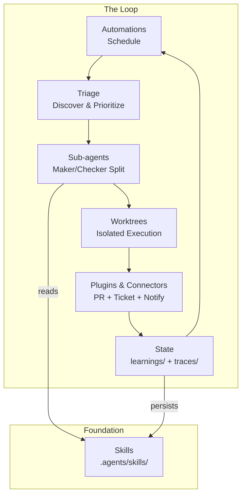
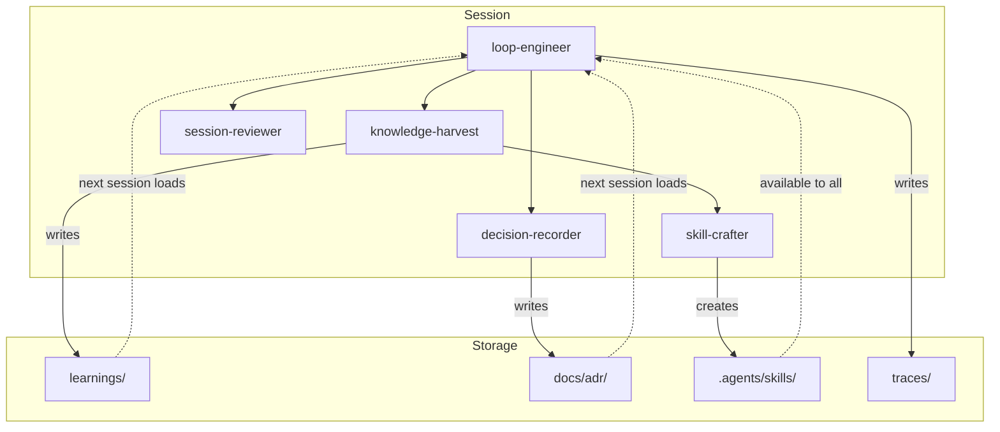
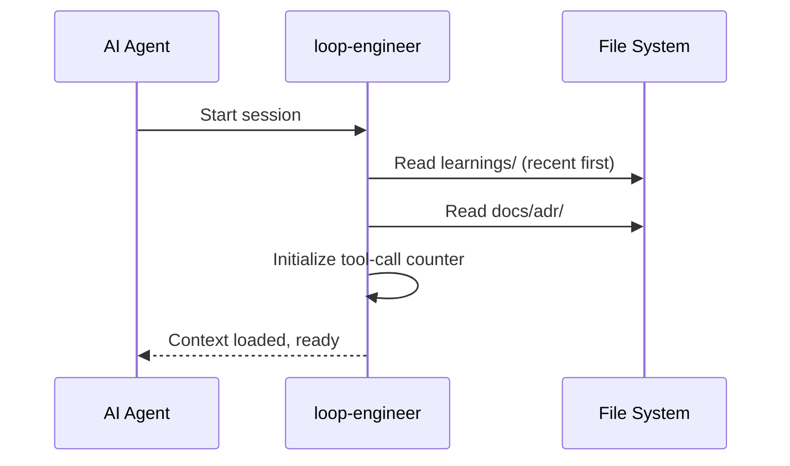
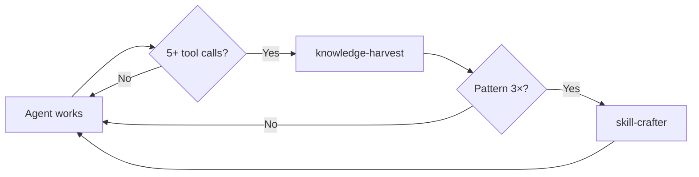
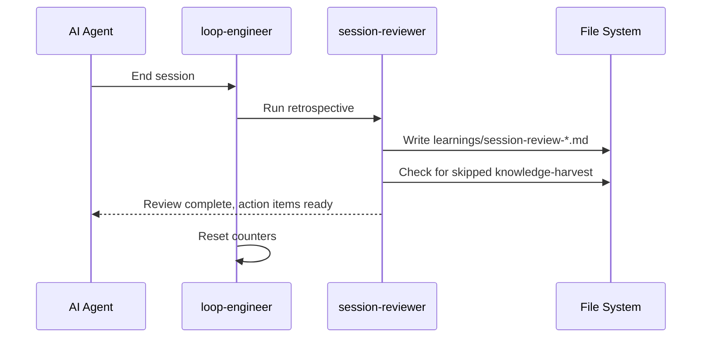
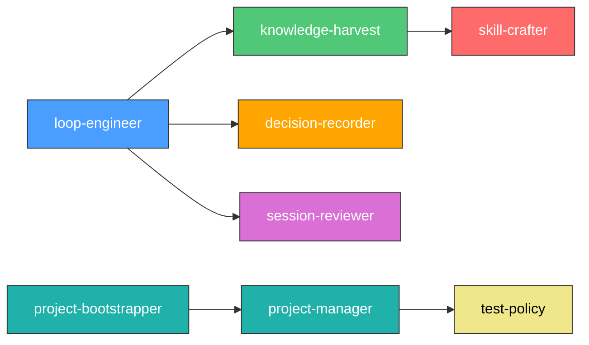
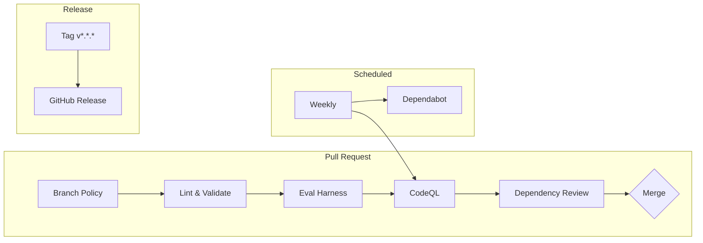

# Loop Engineering Architecture

## System Overview

Loop Engineering implements a **procedural memory** system for AI agents. Instead of starting each session from scratch, agents progressively build a reusable knowledge base of skills, learnings, and decisions. The system is built on **6 core building blocks** that compose into autonomous loops.

## The 6 Building Blocks

| Block | Role | Location |
|-------|------|----------|
| **Automations** | Scheduled execution — the heartbeat of the loop | `.agents/config/schedules.yaml`, `.github/workflows/agent-harness.yml` |
| **Worktrees** | Isolated environments for parallel sub-agents | `project-manager` skill, `git worktree` |
| **Skills** | Codified project knowledge and conventions | `.agents/skills/*/SKILL.md` |
| **Plugins & Connectors** | Real tool access via MCP servers + distribution bundles | `.mcp/*.json` |
| **Sub-agents** | Maker/checker split for quality | `.agents/agents/*.yaml` |
| **State** | Cross-session memory of what's done and next | `learnings/`, `docs/adr/`, `traces/` |



## Session Lifecycle



## The Loop Lifecycle

### Session Start



### During Session



### Session End



## Skill Dependencies



## Data Flow

| Artifact | Created By | Used By | Format |
|----------|-----------|---------|--------|
| `learnings/*.md` | knowledge-harvest | loop-engineer (next session) | Markdown with frontmatter |
| `docs/adr/NNN-*.md` | decision-recorder | loop-engineer (next session) | Markdown with status |
| `.agents/skills/*/SKILL.md` | skill-crafter | All agents | agentskills.io YAML+Markdown |
| `traces/YYYY-MM-DD-*.json` | loop-engineer | analyze-traces.py | JSON metrics |
| `learnings/session-review-*.md` | session-reviewer | loop-engineer (next session) | Markdown with action items |

## Tool Implementation Mapping

Each of the 6 building blocks is implemented in both major coding agents. The names differ slightly; the capability is the same:

| Block | Claude Code | Notes |
|-------|-------------|-------|
| **Automations** | Scheduled tasks, cron, `/loop` (cadence), `/goal` (run-until-done), hooks, GitHub Actions | Both tools support `/goal` — a separate model checks the stop condition |
| **Worktrees** | `git worktree`, `--worktree` flag, `isolation: worktree` on subagents | Isolated checkouts so parallel agents don't collide |
| **Skills** | Agent Skills (`SKILL.md`) — loaded automatically or invoked explicitly | Same SKILL.md format across both tools |
| **Plugins & Connectors** | MCP servers + plugins. Lifecycle hooks fire shell commands at agent lifecycle points | MCP is the shared protocol; plugins are the distribution mechanism |
| **Sub-agents** | Task subagents in `.claude/agents/`, agent teams | Maker/checker split; different models catch different mistakes |
| **State** | Markdown (AGENTS.md, STATE.md, progress files), Linear via MCP | *"The model forgets between runs. The repo doesn't."* |

## CI Pipeline Architecture



## Project Registry

The `repo-registry.yaml` (created by project-bootstrapper) tracks all projects created from this template:

```yaml
- name: my-app
  path: ${PROJECTS_DIR}/my-app/repo-my-app
  visibility: public
  language: typescript
  framework: next.js
  build_tool: npm
  test_framework: vitest
  created_at: "2026-07-16T10:00:00"
  description: "Web application with auth"
```

This is used by `project-manager` to dispatch tasks to the correct project worktrees.
