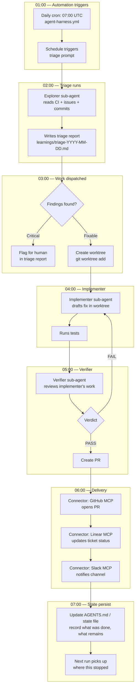

# The "One Loop": A Complete Loop Engineering Workflow

> *"An automation runs every morning on the repo. Its prompt calls a triage skill that reads yesterday's CI failures, the open issues, the recent commits, and writes the findings into a markdown file or a Linear board. For each finding that is worth doing the thread opens an isolated worktree and sends a sub-agent to draft the fix, and a second sub-agent reviews that draft against the project skills and the existing tests. Connectors let the loop open the PR and update the ticket. The state file is the spine of the whole thing, it remembers what got tried, what passed, what is still open, so tomorrow morning the run picks up where today stopped."*
>
> — **Addy Osmani**, [Loop Engineering](https://addyosmani.com/blog/loop-engineering/)

This document shows how the 6 building blocks of loop engineering compose into a real, working autonomous loop.

## The 6 Blocks

| Block | Role | Template Artifact |
|-------|------|-------------------|
| **Automations** | Scheduled execution — the heartbeat | `.agents/config/schedules.yaml`, `agent-harness.yml` |
| **Worktrees** | Parallel isolation — no file collisions | `project-manager` skill, `git worktree` |
| **Skills** | Project knowledge — stop re-explaining | `.agents/skills/*/SKILL.md` |
| **Connectors** | Real tool access — MCP servers | `.mcp/*.json` |
| **Sub-agents** | Maker/checker split — catch errors | `.agents/agents/*.yaml` |
| **State** | Cross-session memory — what's done and next | `learnings/`, AGENTS.md, traces/ |

## Concrete Example: Morning Triage Loop

This is the "one loop" pattern from Addy's article, mapped to template components:



## Running the Loop

### Step 1: Set up the Automation

**GitHub Actions** (shipped):
```yaml
# .github/workflows/agent-harness.yml
on:
  schedule:
    - cron: '0 7 * * 1-5'  # Weekdays at 07:00 UTC
```

**Alternative: cron + Hermes**:
```bash
# crontab -e
0 7 * * 1-5 cd /path/to/repo && hermes cron run --skill triage
```

**Alternative: Claude Code**:
```bash
claude --schedule "0 7 * * 1-5" --task "Run daily triage"
```

### Step 2: The Triage Prompt

When the automation fires, it runs a prompt like:
```
Run daily CI triage:
1. Check CI runs on main/develop (gh run list)
2. Review open issues (gh issue list)
3. Check recent commits (git log --since=24h)
4. Categorize findings into Critical / Needs-Attention / Info
5. Write report to learnings/triage-YYYY-MM-DD.md
6. Flag critical items for immediate review
```

### Step 3: Sub-agent Dispatch

For each fixable finding, dispatch the maker/checker pipeline:

```bash
# Create isolated worktree
git worktree add worktrees/fix-auth-bug feature/fix-auth-bug-$(date +%s)

# Run implementer in worktree
cd worktrees/fix-auth-bug
opencode --task "Fix the auth token expiry bug (see triage report)"

# Run verifier on the result
cd worktrees/fix-auth-bug
opencode --task "Review the auth fix. Run tests. Check security."
```

### Step 4: Connectors Close the Loop

With MCP servers configured in `.mcp/`:

- **GitHub MCP** → creates the PR automatically
- **Linear/Jira MCP** → updates the ticket: "Fix in PR #123"
- **Slack MCP** → posts to channel: "✅ Auth fix ready for review"

### Step 5: State Persists

The AGENTS.md or a progress file records what happened:

```markdown
## Triage: 2026-07-17
- ✅ CI health: clean (all checks passing)
- ✅ Issues reviewed: 3 open, 0 new critical
- ✅ Auth fix: PR #123 created
- ⏳ Rate limiting issue: needs investigation
- ⏳ EOL dependency warning: scheduled for next week
```

Next morning's run reads this file and continues from ⏳ items.

## Customizing the Loop

### Swap Components

| Component | Options |
|-----------|---------|
| **Scheduler** | GitHub Actions cron, systemd timer, `crontab`, Hermes cron, Codex Automations |
| **Agent** | Claude Code, Codex, Hermes, Opencode, Gemini CLI |
| **Sub-agents** | Native (`.claude/agents/`, `.codex/agents/`), CLI (`opencode --task`), Hermes `delegate_task()` |
| **Connectors** | MCP servers, custom API scripts, webhooks |
| **State storage** | Markdown files, Linear board, GitHub Issues, Notion DB |

### Scale Up: Multi-repo Loop

Use `project-manager` with worktrees to dispatch across repos:

```bash
# project-manager dispatches to each registered project
for repo in $(cat $PROJECTS_DIR/repo-registry.yaml | yq '.[].name'); do
    project-manager $repo "Run triage for this project"
done
```

## ⚠️ Critical Warnings

Read these before running any unattended loop:

### 1. Verification is Still On You
A loop running unattended is also a loop making mistakes unattended. The verifier sub-agent reduces this risk but does NOT eliminate it. **Always review PRs created by automated loops.** The maker/checker split makes the loop's "it's done" claim more reliable, but "done" is a claim, not a proof.

### 2. Comprehension Debt
The faster the loop ships code you did not write, the bigger the gap between what exists and what you understand. Read the loop's output regularly. A smooth loop that hides complexity is dangerous — it grows your comprehension debt silently.

### 3. Cognitive Surrender
When the loop runs itself, it's tempting to stop having an opinion and just accept whatever it returns. **Designing the loop is the cure when done with judgment, and the accelerant when done to avoid thinking.** Same action, opposite result.

### 4. Token Cost Awareness
- Explorer: ~3K tokens/run (cheap)
- Implementer: ~15K tokens/run (expensive — where most costs occur)
- Verifier: ~8K tokens/run (moderate, but essential)
- A full morning cycle: ~30-50K tokens
- Set token budgets and monitor usage

## Reference: One-Loop Quickstart

```bash
# 1. Ensure prerequisites
which gh git opencode  # or claude, hermes

# 2. Set up the automation schedule
#    (agent-harness.yml has schedule built in)

# 3. Test the triage script
bash scripts/daily-triage.sh

# 4. Try the sub-agent pipeline
cat .agents/agents/explorer.yaml
cat .agents/agents/implementer.yaml
cat .agents/agents/verifier.yaml

# 5. Configure your connectors
cp .mcp/example-config.json .mcp/local.json
# Edit with your credentials

# 6. Start a manual loop
# "Run the morning triage loop"
```

---

## 🇯🇵 日本語

このドキュメントは、Loop Engineering の6つの構成要素が実際の自律ループとしてどのように連携するかを示しています。構成要素は：Automations（自動実行）、Worktrees（作業分離）、Skills（知識）、Connectors（ツール連携）、Sub-agents（サブエージェント）、State（状態管理）です。

各要素は独立して使用できますが、真の価値は全てが連動して動作する「One Loop」パターンで発揮されます。
